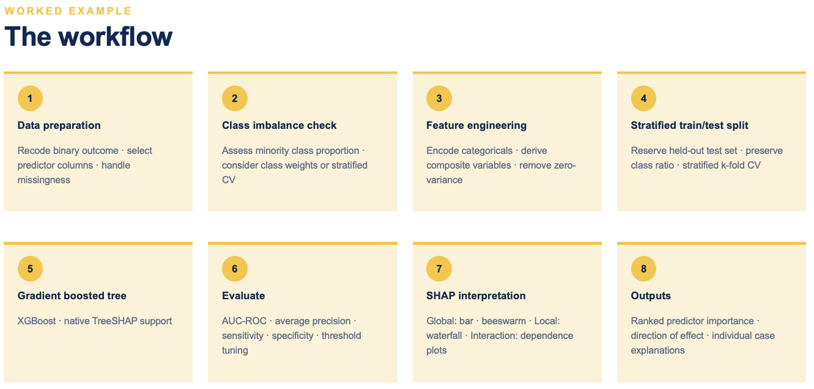

```{r setup, include=FALSE}
knitr::opts_chunk$set(eval = TRUE, warning = FALSE, message = FALSE)
```

# Overview

This tutorial documents a general-purpose workflow for identifying risk
factors in tabular data using gradient-boosted trees (XGBoost) and SHAP
(SHapley Additive exPlanations). It's organised around the eight-step
pipeline below, using the simulated data created in Session 1. These
steps and the data involved, although artificially generated, have been
created to highlight a range of issues that commonly occur in data cleaning 
and model fitting.



1.  **Data preparation** — recode the outcome, select predictor columns,
    handle missingness.
2.  **Class imbalance check** — assess the minority class proportion,
    decide on class weights and/or stratified CV.
3.  **Feature engineering** — encode categoricals, derive composite
    variables, remove zero-variance/redundant columns.
4.  **Stratified train/test split** — hold out a test set and use
    stratified k-fold CV.
5.  **Model** — gradient boosted trees,
    chosen for native or SHAP-compatible tree structure.
6.  **Evaluate** — CV metrics, threshold tuning, final test-set
    performance.
7.  **SHAP interpretation** — global importance, local explanations,
    marginal effects.
8.  **Outputs** — ranked predictor importance, direction of effect,
    individual case explanations.

# Setup

```{r packages, message=FALSE, warning=FALSE}
library(tidyverse) # for data cleaning
library(tidymodels) # to keep track of models
library(xgboost) # to fit the models
library(shapviz) # to extract the SHAP valuese
```

# Simulated dataset

The simulation below is deliberately messy in the same ways real project
data tends to be: a mix of numeric and categorical predictors, missing
values with different mechanisms (missing-at-random vs. "not asked"), a
redundant pair of near-duplicate predictors, a zero-variance column, a
"volume marker" that correlates with everything but isn't causal, and a
**rare** binary outcome. Every one of these quirks is deliberately
created so the later sections have something real to demonstrate.

```{r simulate-data}
set.seed(42)
n <- 2000

sim_data <- tibble(
  record_id  = seq_len(n),
  site_id    = sample(paste0("site_", 1:20), n, replace = TRUE),
  category_a = sample(c("A", "B", "C", NA), n, replace = TRUE,
                       prob = c(0.40, 0.35, 0.20, 0.05)),
  category_b = sample(c("yes", "no", NA), n, replace = TRUE,
                       prob = c(0.30, 0.60, 0.10)),
  feature_1  = rnorm(n, mean = 50, sd = 10),
  feature_2  = rnorm(n, mean = 20, sd = 5),
  feature_3  = rpois(n, lambda = 4),
  feature_4  = runif(n, 0, 1),
  feature_5  = rnorm(n, mean = 0, sd = 1),
  feature_6  = rbinom(n, 1, 0.3),
  feature_7  = rbinom(n, 1, 0.15),
  feature_8  = rnorm(n, mean = 100, sd = 30),
  activity_level = rpois(n, lambda = 50)
) |>
  mutate(
    # feature_2_alt is a near-duplicate of feature_2 — a redundant pair
    feature_2_alt = feature_2 + rnorm(n, 0, 0.5),
    # constant_col has zero variance and should be dropped
    constant_col  = 1,
    # a "volume marker": correlates with other features via site activity,
    # but isn't itself a causal risk factor (mirrors things like reporting
    # volume or facility throughput in real administrative data)
    feature_3 = feature_3 + round(activity_level / 10),
    feature_6 = if_else(runif(n) < activity_level / 100, 1, feature_6),
    # composite source flags, each with some missingness — analogous to
    # sub-items that get combined into one derived indicator
    flag_x1 = sample(c(0, 1, NA), n, replace = TRUE, prob = c(0.70, 0.20, 0.10)),
    flag_x2 = sample(c(0, 1, NA), n, replace = TRUE, prob = c(0.80, 0.10, 0.10)),
    flag_x3 = sample(c(0, 1, NA), n, replace = TRUE, prob = c(0.75, 0.15, 0.10)),
    # missing-at-random numeric predictors — will need imputation, not zero-fill
    feature_1 = if_else(runif(n) < 0.05, NA_real_, feature_1),
    feature_8 = if_else(runif(n) < 0.05, NA_real_, feature_8)
  )

# Outcome: a rare binary event, generated as a logistic function of a few
# informative predictors plus noise, so imbalance handling has real work to do
lin_pred <- with(sim_data,
  -4.2 +
    0.03 * (feature_1 - 50) +
    0.15 * feature_5 +
    0.80 * feature_6 +
    -0.02 * (feature_8 / 10) +
    1.10 * coalesce(category_a == "C", FALSE)
)
prob_event <- plogis(coalesce(lin_pred, -4.2))

sim_data <- sim_data |>
  mutate(outcome = factor(rbinom(n, 1, prob_event),
                           levels = c(0, 1), labels = c("no_event", "event")))

cat("Simulated", nrow(sim_data), "rows;", "event rate:",
    round(mean(sim_data$outcome == "event") * 100, 1), "%\n")
```

------------------------------------------------------------------------

# Step 1: Data preparation

## Recoding the outcome

This tutorial is written for a binary outcome — an event that either
happened or didn't. Real data doesn't always arrive that way: it's
common for the raw outcome to start as a count or a continuous measure
and need recoding to binary first. Worth doing when:

- **reporting is reliable about occurrence but not about magnitude** —
  e.g. two sites count cases differently, so "12 vs 15" isn't
  trustworthy, but "any cases vs none" is;
- there's a **meaningful operational or clinical threshold** — the
  question that matters downstream is "did this cross the line", not
  "by how much";
- the raw measure is **heavily skewed or zero-inflated**, where most
  units report zero and a handful report very high values — modelling
  "did an event happen" is often more robust than modelling the count
  itself;
- the outcome is **rare**, which is exactly the case this tutorial's
  class-imbalance handling (Step 2) and threshold tuning (Step 6) are
  built around.

This isn't free: dichotomising a continuous outcome throws away real
variation and can be sensitive to where the cutoff is drawn, so it
should be a deliberate choice tied to one of the reasons above, not a
default.

In this tutorial, `outcome` was already simulated as binary (in
"Simulated dataset", above) to keep the focus on the modelling pipeline
rather than the recoding step itself. On a real project, this is where
that decision gets made and applied, e.g.:

```{r step1-recode-pattern}
recode_example <- tibble(site_id = 1:6, case_count = c(0, 0, 3, 0, 1, 0))

recode_example |>
  mutate(outcome = factor(if_else(case_count > 0, "event", "no_event"),
                           levels = c("no_event", "event")))
```

## Renaming coded columns

Source systems often store variables under opaque codes (database IDs,
survey question codes) rather than readable names. Start by listing the
columns so you can spot the unintuitive ones:

```{r step1-column-names}
names(sim_data)
```

`feature_1` is standing in for that kind of opaque code here — rename
it once, for real, and every later step (the recipe, the SHAP labels,
the outputs) then just uses the new name:

```{r step1-rename}
sim_data <- rename(sim_data, measurement_a = feature_1)
```

> Renaming several columns at once works the same way with a named
> lookup vector and `rename_with()`:
> `rename_with(sim_data, ~ lookup[.x], .cols = any_of(names(lookup)))`.

## Selecting predictor columns and identifying non-predictors

Explicitly separate identifiers, the outcome, and predictors before
doing anything else — this list is what every later `select()`/recipe
call should reference, so it only needs to be defined once.

```{r step1-column-roles}
id_cols     <- c("record_id", "site_id")
outcome_col <- "outcome"

predictor_cols <- setdiff(names(sim_data), c(id_cols, outcome_col))
cat("Candidate predictors:", length(predictor_cols), "\n")
```

## Missingness

Summarise missingness per column before deciding how to handle it. The
key judgement call: **does missing mean a true zero / absence** (e.g. an
event count that was never recorded because nothing happened), in which
case `replace_na(0)` is correct — **or does missing mean unknown** (e.g.
a survey question that wasn't answered), in which case zero-filling
would silently bias the model and imputation (numeric) or an explicit
`"unknown"` factor level (categorical) is the safer choice.

```{r step1-missingness}
missingness <- sim_data |>
  select(all_of(predictor_cols)) |>
  summarise(across(everything(), ~ round(mean(is.na(.)) * 100, 1))) |>
  pivot_longer(everything(), names_to = "variable", values_to = "pct_missing") |>
  arrange(desc(pct_missing))

print(missingness, n = Inf)
```

In this simulated dataset, `measurement_a`/`feature_8` are missing-at-random
(→ impute later, in the recipe) and `category_a`/`category_b`/the
`flag_*` columns are "not recorded" (→ explicit unknown level /
composite-flag logic below). Neither is zero-filled here, since none of
these represent a genuine structural zero — but if you're working with
count data where missing really does mean zero, that step belongs here:

```{r step1-zero-fill-pattern}
# Example only — not applied to sim_data, since nothing here is a genuine
# structural zero:
# clean_data <- sim_data |>
#   mutate(across(all_of(some_count_cols), ~ replace_na(., 0)))
```

------------------------------------------------------------------------

# Step 2: Class imbalance check

Check the minority class proportion **before** doing any predictor
engineering — the right choice for a near-balanced outcome (this
dataset's original `feature_6`/`feature_7`, say) is very different from
the right choice for a rare event like `outcome` here.

```{r step2-imbalance}
n_majority <- sum(sim_data$outcome == "no_event")
n_minority <- sum(sim_data$outcome == "event")

cat("Class counts — no_event:", n_majority, " event:", n_minority, "\n")
cat("Event prevalence:", round(n_minority / (n_majority + n_minority) * 100, 2), "%\n")
cat("Imbalance ratio (majority:minority):", round(n_majority / n_minority, 1), ":1\n")

# sqrt of the ratio is a common, less aggressive alternative to the raw
# ratio for XGBoost's scale_pos_weight — it upweights the minority class
# without letting it dominate the loss entirely
weight_ratio <- sqrt(n_majority / n_minority)
cat("scale_pos_weight (sqrt of ratio):", round(weight_ratio, 2), "\n")
```

As a rule of thumb: near-balanced outcomes (roughly 40:60 or better)
often need nothing more than a stratified split. Moderate imbalance (up
to \~10:1) usually benefits from `scale_pos_weight`. Severe imbalance
(50:1 and beyond, as here) needs both `scale_pos_weight` *and*
deliberate threshold tuning in Step 6 — a default 0.5 cutoff will
predict the majority class for almost everyone.

------------------------------------------------------------------------

# Step 3: Feature engineering

## Deriving composite variables

Where several sub-items measure related sub-components of one underlying
concept, it's often cleaner to combine them into a single derived flag
than to feed the model each sub-item separately. The pattern below is
`NA` only when *every* contributing item is missing; otherwise it's `1`
if any contributing item was positive:

```{r step3-composite}
sim_data <- sim_data |>
  mutate(
    flag_any = if_else(
      rowSums(!is.na(across(c(flag_x1, flag_x2, flag_x3)))) == 0,
      NA_real_,
      if_else(rowSums(across(c(flag_x1, flag_x2, flag_x3), ~ . == 1), 
                      na.rm = TRUE) > 0, 1, 0)
    )
  ) |>
  select(-flag_x1, -flag_x2, -flag_x3)

# predictor_cols was fixed in Step 1, before flag_any existed and before
# flag_x1/x2/x3 were dropped — refresh it so it matches sim_data's current
# columns before anything downstream references it
predictor_cols <- setdiff(names(sim_data), c(id_cols, outcome_col))
```

## Multicollinearity: correlation screen and zero-variance columns

XGBoost is fairly robust to multicollinearity for *prediction*, and a
variable with a weak marginal correlation to the outcome can still
matter in combination with others (a classic suppressor-variable
situation), so dropping one member of a correlated pair purely on a
pre-model correlation statistic risks throwing away real signal.
Instead, every predictor stays in the modelling frame, and correlated
pairs are flagged for a cautious read once real SHAP values exist —
if two highly-correlated predictors both turn up as top predictors,
that's shared attribution across a real correlation, not
necessarily two independent risk factors. The flagging itself happens
directly on the plots in Step 7; this just computes what to flag.

```{r step3-multicollinearity}
# Zero variance
constant_cols <- sim_data |>
  select(all_of(predictor_cols)) |>
  select(where(~ n_distinct(., na.rm = TRUE) <= 1)) |>
  names()
cat("Zero-variance columns:", paste(constant_cols, collapse = ", "), "\n")

# Correlation matrix over numeric predictors only — categorical
# association would need a different measure (e.g. Cramer's V) and
# isn't covered here
numeric_predictors <- sim_data |>
  select(all_of(predictor_cols)) |>
  select(where(is.numeric)) |>
  names()

cor_matrix <- sim_data |>
  select(all_of(numeric_predictors)) |>
  cor(use = "pairwise.complete.obs")

# Every pair worth keeping in mind when reading SHAP later. Nothing
# gets dropped from this — it's carried through to Step 7 purely to
# flag bars/points on the importance plots, not to shrink predictor_cols
high_cor_pairs <- as_tibble(cor_matrix, rownames = "var1") |>
  pivot_longer(-var1, names_to = "var2", values_to = "r") |>
  filter(var1 < var2, abs(r) >= 0.5) |>
  arrange(desc(abs(r)))
print(high_cor_pairs)

# Stricter cutoff used in Step 7 to decide which pairs are flagged
# directly on the plots — 0.5 above is deliberately loose (a wide net
# for the printed table), this is the "near-duplicate, flag it visibly"
# threshold
redundancy_cutoff <- 0.8
```

## Dropping "volume marker" columns

Some columns proxy the *size* or *activity level* of a unit (a site, a
zone, a respondent's exposure to the health system) rather than being a
risk factor in their own right. They tend to show up as spuriously
important in SHAP if left in, so it's worth identifying and dropping
them deliberately, with the reasoning recorded:

```{r step3-drop-vars}
volume_markers <- c("activity_level")   # correlates with feature_3/feature_6 by construction, not causal
zero_variance  <- constant_cols          # e.g. "constant_col"

vars_to_drop   <- c(volume_markers, zero_variance)
predictor_cols <- predictor_cols[!predictor_cols %in% vars_to_drop]

cat("Predictors after dropping volume markers / zero-variance columns:",
    length(predictor_cols), "\n")
print(predictor_cols)
```

Categorical encoding (`step_dummy`), unseen-level handling
(`step_novel`), and explicit missing-level handling (`step_unknown`) are
also feature engineering, but are implemented inside the modelling
**recipe** in Step 5 rather than here — that keeps them tied to the
train/test split so no information leaks from test into train.

## Build the modelling frame

```{r step3-modelling-frame}
model_data <- sim_data |>
  select(all_of(id_cols), all_of(outcome_col), all_of(predictor_cols))

cat("Modelling frame:", nrow(model_data), "rows x", ncol(model_data), "columns\n")
```

------------------------------------------------------------------------

# Step 4: Stratified train/test split

Stratifying on the outcome — for both the initial split and every CV
fold — keeps the class ratio consistent across train, test, and every
fold, which matters more the rarer the event is.

```{r step4-split}
set.seed(42)
split      <- initial_split(model_data, prop = 0.8, strata = outcome)
train_data <- training(split)
test_data  <- testing(split)

cv_folds <- vfold_cv(train_data, v = 10, strata = outcome)

cat("Train:", nrow(train_data), " Test:", nrow(test_data), "\n")
cat("Train event rate:", round(mean(train_data$outcome == "event") * 100, 2), "%\n")
cat("Test event rate:",  round(mean(test_data$outcome  == "event") * 100, 2), "%\n")
```

------------------------------------------------------------------------

# Step 5: Model

The recipe encodes categoricals, handles unseen factor levels and
explicit missingness, imputes the numeric columns that are
missing-at-random, and drops any residual zero-variance columns as a
safety net. Identifier columns are given an `"ID"` role so they're
carried through without being treated as predictors.

```{r step5a-recipe}
xgb_recipe <- recipe(outcome ~ ., data = train_data) |>
  update_role(all_of(id_cols), new_role = "ID") |>
  step_novel(all_nominal_predictors()) |>
  step_unknown(all_nominal_predictors()) |>
  step_dummy(all_nominal_predictors()) |>
  step_impute_median(measurement_a, feature_8) |>
  step_zv(all_predictors())

xgb_spec <- boost_tree(
  trees          = 500,
  tree_depth     = 4,
  learn_rate     = 0.05,
  loss_reduction = 0.01,
  min_n          = 10
) |>
  set_engine("xgboost", scale_pos_weight = weight_ratio) |>
  set_mode("classification")

xgb_workflow <- workflow() |>
  add_recipe(xgb_recipe) |>
  add_model(xgb_spec)
```

Make a note of the tuning parameters in lines 429-434. These should be 
published alongside your model for reproducability. All of these can be 
changed, and can be explored manually or with a grid search. 
Sometimes it can be helpful to fit them with the default values, assess
model fit, and then tune if needed to extract additional predictive power
from your model set up. 

------------------------------------------------------------------------

# Step 6: Evaluate

## Cross-validated performance

```{r step6-cv}
cv_results <- fit_resamples(
  xgb_workflow,
  resamples = cv_folds,
  metrics   = metric_set(roc_auc, average_precision),
  control   = control_resamples(save_pred = TRUE)
)

collect_metrics(cv_results) |> print()
```

## Threshold tuning

With a rare outcome, model probabilities are calibrated to population
prevalence, so the default 0.5 cutoff is nearly always wrong. Start the
threshold near prevalence, then sweep a small grid to find the best
sensitivity/specificity/F1 trade-off for your use case:

```{r step6-threshold}
threshold <- n_minority / (n_minority + n_majority)

cv_preds <- collect_predictions(cv_results) |>
  mutate(.pred_class = factor(
    if_else(.pred_event >= threshold, "event", "no_event"),
    levels = c("no_event", "event")
  ))

pooled_metrics <- bind_rows(
  roc_auc(cv_preds,           truth = outcome, .pred_event,           event_level = "second"),
  average_precision(cv_preds, truth = outcome, .pred_event,           event_level = "second"),
  sensitivity(cv_preds,       truth = outcome, estimate = .pred_class, event_level = "second"),
  specificity(cv_preds,       truth = outcome, estimate = .pred_class, event_level = "second"),
  ppv(cv_preds,               truth = outcome, estimate = .pred_class, event_level = "second"),
  npv(cv_preds,               truth = outcome, estimate = .pred_class, event_level = "second")
)
print(pooled_metrics)

thresholds <- c(0.02, 0.05, 0.1, 0.15, 0.2, 0.3, 0.5)

threshold_comparison <- map_dfr(thresholds, function(thresh) {
  cv_preds_t <- collect_predictions(cv_results) |>
    mutate(.pred_class = factor(
      if_else(.pred_event >= thresh, "event", "no_event"),
      levels = c("no_event", "event")
    ))
  tibble(
    threshold   = thresh,
    sensitivity = sensitivity_vec(cv_preds_t$outcome, cv_preds_t$.pred_class, event_level = "second"),
    specificity = specificity_vec(cv_preds_t$outcome, cv_preds_t$.pred_class, event_level = "second"),
    ppv         = ppv_vec(cv_preds_t$outcome,         cv_preds_t$.pred_class, event_level = "second"),
    f1          = f_meas_vec(cv_preds_t$outcome,      cv_preds_t$.pred_class, event_level = "second")
  )
})
print(threshold_comparison)

# Pick the threshold that maximises F1 (or another criterion suited to
# your use case — e.g. lowest threshold with sensitivity above some floor)
threshold <- threshold_comparison |> slice_max(f1, n = 1) |> pull(threshold)
cat("Selected threshold:", threshold, "\n")
```

## Final fit and test-set evaluation

```{r step6-final}
final_fit <- fit(xgb_workflow, data = train_data)

test_preds <- augment(final_fit, test_data) |>
  mutate(.pred_class = factor(
    if_else(.pred_event >= threshold, "event", "no_event"),
    levels = c("no_event", "event")
  ))

test_summary <- bind_rows(
  roc_auc(test_preds,     truth = outcome, .pred_event,           event_level = "second"),
  sensitivity(test_preds, truth = outcome, estimate = .pred_class, event_level = "second"),
  specificity(test_preds, truth = outcome, estimate = .pred_class, event_level = "second"),
  ppv(test_preds,         truth = outcome, estimate = .pred_class, event_level = "second"),
  npv(test_preds,         truth = outcome, estimate = .pred_class, event_level = "second"),
  f_meas(test_preds,      truth = outcome, estimate = .pred_class, event_level = "second")
)
print(test_summary)
conf_mat(test_preds, truth = outcome, estimate = .pred_class)
```

------------------------------------------------------------------------

# Step 7: SHAP interpretation

Before reading importance off the plots below, check `high_cor_pairs`
from Step 3 for any surviving predictors that were moderately correlated
but not dropped for other reasons. If two such predictors both show up
with modest importance, that may be shared attribution across a real
correlation rather than two independently important risk factors. The
plots below mark this directly — any feature that's part of a pair at
or above `redundancy_cutoff` gets a `*` next to its label — so it's
visible in the moment you're reading the ranking, not just a footnote
you have to remember to go check.

```{r step7-shap-setup}
xgb_model <- extract_fit_engine(final_fit)

train_baked <- xgb_recipe |>
  prep() |>
  bake(new_data = train_data) |>
  # ID-role columns survive baking as ordinary columns even though the
  # model was never trained on them — drop them (and the outcome) by name
  # so the matrix matches the columns xgb_model actually expects
  select(-all_of(id_cols), -outcome) |>
  as.matrix()

shp <- shapviz(xgb_model, X_pred = train_baked)
```

## Renaming features for readable plots

Apply a label lookup at plotting time only, so the underlying matrix
column names (which `shapviz` relies on internally) stay untouched. For
a project with many predictors, extend `feature_labels` to cover all of
them.

```{r step7-relabel}
feature_labels <- c(
  measurement_a = "Measurement A",
  feature_2  = "Measurement B",
  feature_2_alt = "Measurement B (alt)",
  feature_3  = "Count metric",
  feature_4  = "Proportion metric",
  feature_5  = "Standardised score",
  feature_6  = "Binary indicator 1",
  feature_7  = "Binary indicator 2",
  feature_8  = "Measurement C",
  flag_any   = "Composite flag",
  category_a_B = "Category A: B",
  category_a_C = "Category A: C",
  category_a_unknown = "Category A: unknown",
  category_b_yes = "Category B: yes",
  category_b_unknown = "Category B: unknown"
)
present_labels <- feature_labels[names(feature_labels) %in% colnames(shp$X)]

# Features involved in a pair at or above redundancy_cutoff (Step 3) —
# flagged on the plots below rather than dropped from the model
flagged_pairs <- high_cor_pairs |> filter(abs(r) >= redundancy_cutoff)
flagged_raw   <- unique(c(flagged_pairs$var1, flagged_pairs$var2))

# Renamed label, with a warning marker appended for flagged features —
# used everywhere a feature name reaches a plot, so the flag shows up
# consistently on the bar chart, beeswarm, dependence plots and waterfall
label_flagged <- function(raw_names) {
  human <- dplyr::recode(raw_names, !!!present_labels)
  if_else(raw_names %in% flagged_raw, paste0(human, " *"), human)
}

# Same flag, as a lookup rather than a plot marker — for the exported
# tables in Step 8, where a `correlated_with` column is more useful than
# an emoji baked into the feature name
correlated_partners <- function(raw_names) {
  vapply(raw_names, function(nm) {
    partners <- c(flagged_pairs$var2[flagged_pairs$var1 == nm],
                  flagged_pairs$var1[flagged_pairs$var2 == nm])
    if (length(partners) == 0) return(NA_character_)
    paste(dplyr::recode(partners, !!!present_labels), collapse = "; ")
  }, character(1), USE.NAMES = FALSE)
}

shp_renamed <- shp
colnames(shp_renamed$X) <- label_flagged(colnames(shp_renamed$X))
colnames(shp_renamed$S) <- label_flagged(colnames(shp_renamed$S))
```

## Global importance: bar plot

```{r step7-bar, fig.width=8, fig.height=6}
p <- sv_importance(shp, kind = "bar")
p$layers[[1]]$aes_params$fill <- "#4A90D9"
p$data$feature <- label_flagged(as.character(p$data$feature))
p + theme_minimal() +
  theme(text = element_text(size = 13, face = "bold")) +
  labs(x = "Mean |SHAP value|", y = NULL,
       caption = if (length(flagged_raw) > 0)
         paste0("* correlated with another predictor at |r| >= ", redundancy_cutoff,
                " -- see Step 3") else NULL)
```

## Global importance + direction: beeswarm

```{r step7-beeswarm, fig.width=8, fig.height=6}
b <- sv_importance(shp, kind = "beeswarm")
b$data$feature <- label_flagged(as.character(b$data$feature))
b + theme_minimal() +
  theme(text = element_text(size = 13, face = "bold")) +
  labs(x = "SHAP value", y = NULL,
       caption = if (length(flagged_raw) > 0)
         paste0("* correlated with another predictor at |r| >= ", redundancy_cutoff,
                " -- see Step 3") else NULL)
```

## Marginal effects: dependence plots

Showing every predictor gets unwieldy once you have more than a handful
— in practice, subset to the top N by importance:

```{r step7-dependence, fig.width=10, fig.height=8}
top_features <- sv_importance(shp, kind = "bar")$data |>
  arrange(desc(value)) |>
  slice_head(n = 6) |>
  pull(feature) |>
  as.character() |>
  label_flagged()

sv_dependence(shp_renamed, v = top_features) &
  theme_minimal() &
  theme(text = element_text(size = 11, face = "bold"))
```

## Local explanation: waterfall for a single case

Waterfall plots explain one prediction at a time — typically used on a
case of particular interest, e.g. the highest-risk case in the test set:

```{r step7-waterfall, fig.width=8, fig.height=6}
highest_risk_idx <- which.max(test_preds$.pred_event)
sv_waterfall(shp, row_id = highest_risk_idx)
```

------------------------------------------------------------------------

# Step 8: Outputs

The end product of Steps 1–7 is a set of reusable outputs: a ranked
predictor importance table, the direction of each predictor's effect,
and individual case explanations — typically exported for reporting
rather than kept only as plot objects.

```{r step8-outputs}
dir.create("outputs", showWarnings = FALSE)

# Ranked importance table — correlated_with carries the Step 3 flag
# into the export, so the caution survives outside of R too
shap_importance <- sv_importance(shp, kind = "bar", max_display = length(predictor_cols))$data |>
  mutate(
    correlated_with = correlated_partners(as.character(feature)),
    feature = dplyr::recode(as.character(feature), !!!present_labels)
  ) |>
  select(feature, mean_abs_shap = value, correlated_with) |>
  arrange(desc(mean_abs_shap))

write_csv(shap_importance, "outputs/shap_importance.csv")
print(shap_importance)

# Direction of effect: mean signed SHAP value per feature (positive =
# pushes prediction toward "event" on average)
shap_direction <- as_tibble(shp$S) |>
  summarise(across(everything(), mean)) |>
  pivot_longer(everything(), names_to = "feature", values_to = "mean_signed_shap") |>
  mutate(
    correlated_with = correlated_partners(feature),
    feature = dplyr::recode(feature, !!!present_labels)
  ) |>
  arrange(desc(abs(mean_signed_shap)))

write_csv(shap_direction, "outputs/shap_direction.csv")
print(shap_direction)

# Individual case explanation, exported alongside the model's prediction
case_explanation <- as_tibble(shp$S[highest_risk_idx, , drop = FALSE]) |>
  pivot_longer(everything(), names_to = "feature", values_to = "shap_value") |>
  mutate(
    correlated_with = correlated_partners(feature),
    feature = dplyr::recode(feature, !!!present_labels)
  ) |>
  arrange(desc(abs(shap_value)))

write_csv(case_explanation, "outputs/case_explanation_example.csv")
print(case_explanation)
```

------------------------------------------------------------------------

# Adapting this template to a new dataset

Checklist for reusing this document on a real project, in the order
you'll hit the decisions:

- **Step 1** — replace the "Simulated dataset" section with your data
  loading code; recode your outcome to binary if it doesn't already
  arrive that way; set `id_cols` and `outcome_col`; decide per-column
  whether missing means zero (`replace_na(0)`) or unknown (leave as
  `NA`, impute/flag downstream).
- **Step 2** — recompute the class ratio for your actual outcome; decide
  whether `scale_pos_weight` and/or threshold tuning are needed.
- **Step 3** — derive any composite variables specific to your domain;
  re-run the correlation screen on your actual predictor set and sanity
  check `redundancy_cutoff` (0.8 is a reasonable starting point, not a
  universal rule) — nothing gets dropped here, it only sets what Step 7
  flags on the plots; identify and drop any "volume marker" columns that
  proxy size/activity rather than risk.
- **Step 4** — keep `strata = <outcome column>`.
- **Step 5** — adjust `tree_depth`/`learn_rate`/`trees` for your dataset
  size
- **Step 6** — swap the metric set (`roc_auc`/`average_precision`/...)
  if a different pair suits your use case; re-run the threshold sweep.
- **Step 7** — extend `feature_labels` to cover all of your predictors
  (including any dummy-encoded categorical levels); choose how many
  features to show in the dependence plots based on how many you have.
- **Step 8** — export whatever your reporting format needs; the three
  CSVs above (ranked importance, signed direction, one case explanation)
  cover the common cases.
